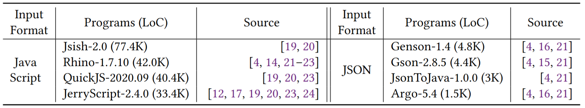

# RSFuzz

RSFuzz is a tool designed to minimize coverage-equivalent input generation in grammar-based fuzzing. It automatically identifies main causes of redundancy and guides the base fuzzer to avoid them, improving efficiency and effectiveness.

## Installation

We recommend using a Docker image for quick and easy installation. For more details about the installation process, please check `Dockerfile`.

```bash
$ docker pull skkusal/rsfuzz:v1.2
$ docker run --rm -it skkusal/rsfuzz:v1.2
```

## Benchmarks

In the docker image, all 12 benchmarks we used are installed in 'root/rsfuzz/benchmark'. Details of benchmarks are as follows:


## How to run RSFuzz
You can run RSFuzz and baseline fuzzers with the following commands in the 'root/rsfuzz/main' directory. There are two required arguments:`benchmark` (target program) and `base_fuzzer` (`random`, `prob`, or `tribble`).

#### Quick Test (1-hour)

We provide an example recurrent sequence for quick evaluation. Run the following commands:
```bash
# Quick test at rsfuzz/main
$ cd /root/rsfuzz/main
# Run the random fuzzer for 1 hour using the provided recurrent sequence
$ python3 runRSFuzz.py --benchmark Rhino --basefuzzer random --capture_time 0 --test_time 3600 --prepared-RS /root/rsfuzz/main/rhino-RS-example.pickle --result_dir RS_result
# Run the random fuzzer for 1 hour with out reccurent sequence
$ python3 runRSFuzz.py --baseline-only --benchmark Rhino --basefuzzer random --capture_time 0 --test_time 3600 --result_dir baseline_result
```

#### Full Experiment (24-hour)

To reproduce the full experiment reported in the paper:
```bash
# Full experiment at rsfuzz/main
$ cd /root/rsfuzz/main
# Run RSFuzz : Generate recurrent sequence and fuzz with it
$ python3 runRSFuzz.py --benchmark Rhino --basefuzzer random --result_dir rsfuzz-result
# run baseline fuzzers : fuzz with base fuzzer alone
$ python3 runRSFuzz.py --baseline-only --benchmark Rhino --basefuzzer random --result_dir baseline-result
```

#### Output Files

The results will be saved in the `{result_dir}/{benchmark}/captured_data` dicrectory. RSFuzz generates 4 main outputs:
1. Recurrent sequences : `recurrent_sequence.pickle` file
2. Test logs : `logs.txt` file
3. Error cases and their derivation trees : `error/*` files
4. Coverage results : `total_coverage.pickle` file

## Additional Experiments

We also provied some additional approaches: naive versions of RSFuzz
- **naive**: RSFuzz without `Select` and `Capture`
- **select**: RSFuzz without `Capture`
- **capture**: RSFuzz without `Select`

You can execute these experiments with the following commands in the 'root/rsfuzz/main' directory:
```bash
# At rsfuzz/main
$ cd /root/rsfuzz/main
# run naive: RSFuzz - (Select, Capture) approaches
$ python3 runNaive.py --benchmark Gson --basefuzzer random --naive_version naive
# run select: RSFuzz - (Capture) approaches
$ python3 runNaive.py --benchmark Gson --basefuzzer random --naive_version select
# run capture: RSFuzz - (Select) approaches
$ python3 runNaive.py --benchmark Gson --basefuzzer random --naive_version capture
```

To check the coverage-equivalent input ratio, you can run the following command. If you omit the `recurrent_sequence` argument, the experiment will run for baseline fuzzers.

```bash
# Check the coverage-equivalent input ratio (Default: 100,000 inputs)
$ cd /root/rsfuzz/main
$ python3 runRatio.py --benchmark Gson --basefuzzer random --recurrent_sequence {path/to/recurrent_sequence.pickle}
```

## Details

For more details about arguments, you can use `--help` commands:

```bash
$python3 run_RSFuzz.py --help
usage: run_RSFuzz.py [options]

Options:
  -h, --help            show this help message and exit
  --benchmark=BENCHMARK
                        Available benchmark: JerryScript, Jsish, QuickJS,
                        Rhino, Argo, Genson, Gson, JsonToJava, jackson-
                        dataformat-csv, super-csv, commonmark, txtmark
  --basefuzzer=BASEFUZZER
                        Base Fuzzer : [random, pcfg, tribble]
  --baseline-only       Run baseline fuzzer without RSFuzz
  --prepared-RS=PREPARED_RS
                        Run fuzzer with prepared recurrent sequence
  --capture_time=CAPTURE_TIME
                        Recurrent sequence generation time(sec) (Default:
                        43200 = 12h)
  --test_time=TEST_TIME
                        Base fuzzer testing time(sec) (Default: 43200 = 12h)
  --result_dir=RESULT_DIR
                        Result directory (Default:
                        results/{basefuzzer}-{benchmark})
  --n_num=N_NUM         Hyperparameter to hanlde n of input generation in a
                        iteration (Default: 2000)
  --test_dir=TEST_DIR   Directory to capture coverage data (Required to test
                        JerryScript, Jsish, or QuickJS)
  --test_pgm=TEST_PGM   Program to run (Required to test JerryScript, Jsish,
                        or QuickJS)
```

## Bug-finding results

Since coverage results are stored in output files, we only provide a Python file, `errorCheck.py`, to check bug-finding results. There are two required arguments: `benchmark` (target program) and `inputs_dir` (e.g., `*/capture_data/error`).
```bash
# At rsfuzz/main
$ cd /root/rsfuzz/main
$ python3 errorCheck.py --benchmark Rhino --inputs_dir ${path-to-error/*}
Exception Type                                    N uniques
java.lang.NullPointerException                    1
java.lang.IllegalArgumentException                3
Detail reports : rsfuzz_results/random/Rhino/captured_data/error/bug-result.txt
```
You can check more details (stack traces) in the `{inputs_dir}/bug-result.txt` file.
